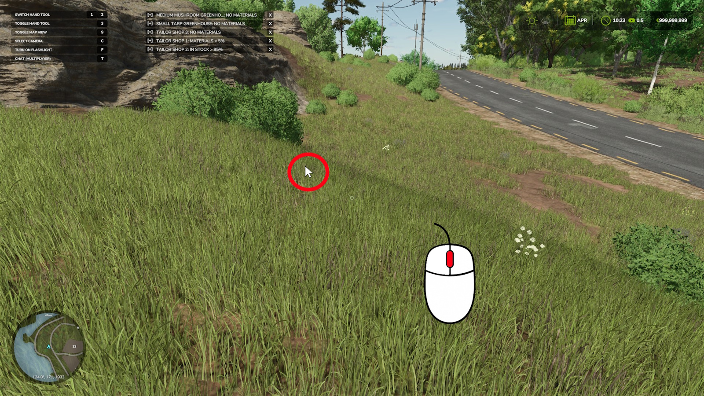
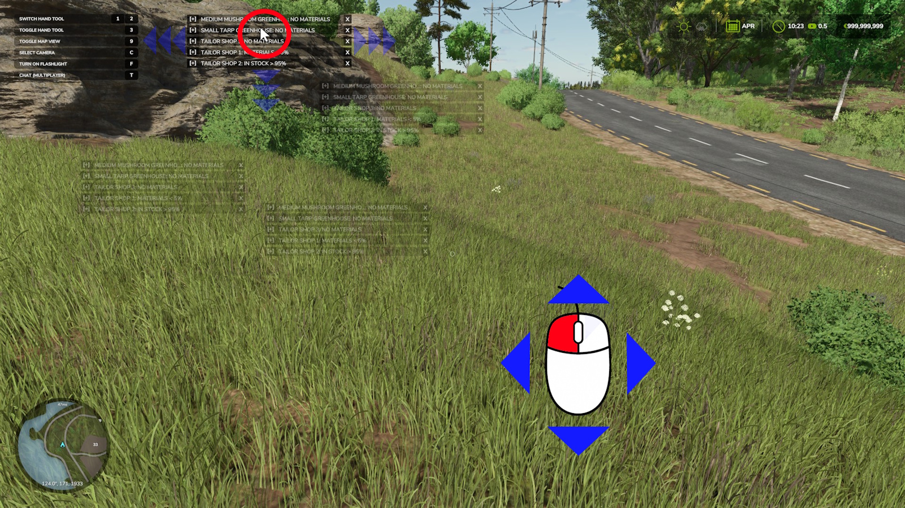
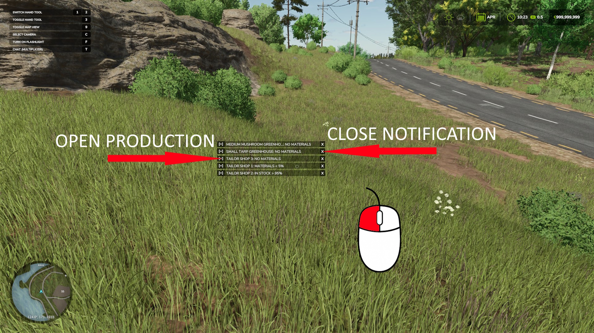

# FS25_ProductionWatcher

This mod tracks the status of your active productions. It will notify you if a production has less than 5% materials remaining, its storage is over 95% full, and direct selling of finished goods is disabled.

## 📦 Features

- Drag-n-drop feature
- Supports singleplayer and multiplayer
- In multiplayer, messages are available to the Farm Manager

## 📁 Installation

1. Download the latest release from the [Releases](https://github.com/Temmmych/FS25_ProductionControl/releases) page or [direct link](https://github.com/Temmmych/FS25_ProductionWatcher/releases/download/V1.0.0.1/FS25_ProductionWatcher.zip).
2. Place the `.zip` file into your mod folder (Example: `Documents/My Games/FarmingSimulator2025/mods`).
3. Enable the mod in the game.

## 🖼️ Screenshots
 
 
  
